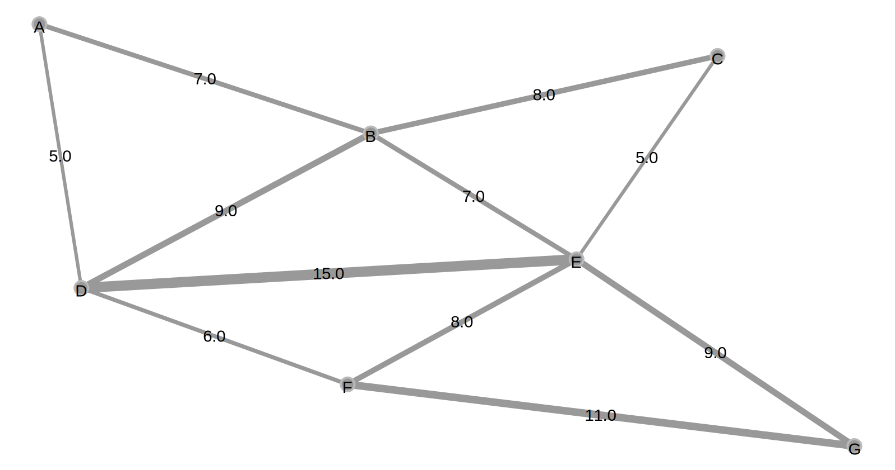

# Kruskal's Minimum Spanning Tree Algorithm Example Data

A description of [Kruskal's Minimum Spanning Tree Algorithm is available on Wikipedia](https://en.wikipedia.org/wiki/Kruskal%27s_algorithm). This repository contains the [initial graph](initial) and [the minimum spanning tree graph](mst) from the Wikipedia article in several formats.

## Intial Graph

[Data](initial)

## Minimum Spanning Tree

[Data](mst)

## See Also

This minimum spanning tree was produced by the Kruskal's algorithm implementation in [the spanning tree module](https://github.com/carlschroedl/gephi-plugins/tree/minimum-spanning-tree-plugin/modules/MinimumSpanningTree) I contributed to [Gephi](https://gephi.org/), an open-source graph visualization, exploration, and analysis project.
